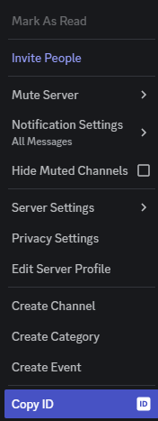

# Work in Progress!

# Python Markov Bot
Made by: Paul Gleason

### Requirements
* discord.py
* markovify
* numpy

## Commands
* `/algorithm` - If `True` will use the creators algorithm. If `False` will use the markovify algorithm.
* `/change-vars` - (Work in Progress)
* `/listen` - If var = `add` will add the channels in channel1-10 to the listening list. If var = `remove` will remove the channels in channel1-10 to the listening list.
* `/listening` - Will display what channels are being listened to.
* `/mark` - Output sentence from training data.
* `/set-channel` - Set channel so bot can only be used in that channel
* `/talk` - If `True` bot will talk in the /set-channel every 10 secondes. If `False` bot can be used as normal.
* `/train` - `True` will remove previous training data (training data is deleted once bot is turned off). `False` will appened new data onto the old data file.  

## Usage
1. Create a Discord bot application
2. Under the "Bot" section, enable the "Message Content Intent", and copy the token for later.
3. Setup and configure the bot using one of the below methods:

# Windows
1. Setup config with correct data.
    * Make a file called `config.py` and add the following.
    * You may need to enable devoloper mode to see Guild ID and User ID
    * `Token:` aquire from developer portal
    * `Guild_ID:` Right click server icon and select 
     
    * `Owner_ID:` Right click user and select 
    
    * 
    ```
    TOKEN = 'jalksdfasjdkjfasdnotarealtoken'
    GUILD_ID = ''
    OWNER_ID = 
    ```

## Setup
download repo

### Config
Make a file called `config.py` and add the following.
```
TOKEN = 
GUILD_ID = 
OWNER_ID = 
```