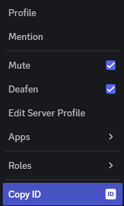
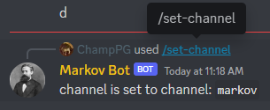
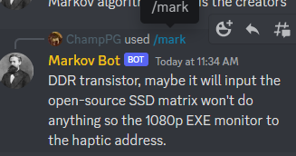

# Python Markov Bot
Made by: Paul Gleason

1. [Project Description](#project-description)
2. [Requirements](#requirements)
3. [Commands](#commands)
4. [Setup](#setup)
5. [Usage](#usage)
   a. [Discord Side](#discord-side)
6. [Config](#config)

## Project Description
A Discord bot that uses Markov Chain to generate sentences from input data that can be taken from discord channels.

## Requirements
* To install requirments - `pip install -r requirements.txt`
* discordpy 
* markovify
* numpy 
* termcolor
### Optional
**Linux**
* python3 -m venv venv
* source ./venv/bin/activate

## Commands
* `/algorithm` - Switch between creators algorithm or markovify (If algorithm is change you must retrain the bot).
    * `Creators`: will use the creators algorithm.
    * `Markovify`: will use the markovify algorithm.
* `/change-vars` - (Work in Progress)
* `/listen` - Add or Remove channels from listening.
    * `add`: will add the channels in channel1-10 to the listening list.
    * `remove`: will remove the channels in channel1-10 to the listening list.
* `/listening` - Will display what channels are being listened to.
* `/mark` - Output sentence from training data.
* `/set-channel` - Set channel so bot can only be used in that channel.
* `/talk` - Give the ability for the bot to talk freely.
    * `True`: bot will talk in the /set-channel every 10 secondes.
    * `False`: bot can be used as normal.
* `/train` - Bot will read messages from listening channels and turn it into a data set for markov.
    * `True`: will remove previous training data (training data is deleted once bot is turned off). 
    * `False`: will appened new data onto the old data file.  

## Setup
1. Download Repo by cloning or ZIP.
2. Enter the working directory.
3. Copy the `config_Example.py` and call the copy `config.py` then follow `step 1` under `Discord Side`.
4. Run `bot.py`

## Usage
1. Create a [Discord bot application](https://discordapp.com/developers/applications/)
2. Under the "Bot" section, enable the "Message Content Intent", and copy the token for later.
3. Invite link: `https://discord.com/oauth2/authorize?client_id={APPLICATION_ID}&scope=bot+applications.commands&permissions=105472` Just put your bots application ID.
3. Setup and configure the bot using one of the below methods:

# Discord Side
1. Setup config with correct data.
    * Copy the `config_Example.py` and called the file `config.py` and add the following.
    * You may need to enable devoloper mode to see Guild ID and User ID
    * `Token`: aquire from developer portal
    * `Owner_ID`: Right click user and select \
    
    * Config File Example:
    ```
    TOKEN = 'jalqwerjnzxljfasdnotarealtoken'
    OWNER_ID = ['notrealownderidmewqior', 'anothernotrealowner_idajli']
    ```

2. Configure bot channel:
    * User: `/set-channel`
    * Bot: \
    

3. Configure channels for bot to listen to: \
    3.1. **To add channels**
    * User: `/listen add {Channels}`
    * Bot: \
    

    3.2. **To remove channels**
    * User: `/listen remove {Channels}`
    * Bot: \
    

4. Choice algorithm: \
    4.1. **Creators Algorithm**
    * User: `/algorithm True`
    * Bot: \
    

    4.2. **Markovify Algorithm**
    * User: `/algorithm False`
    * Bot: \
    

5. Train Bot (depending on channel size this may take some time): \
    5.1. **If running for the first time use or want to start over training set `True`**

    * User: `/train True`
    * Bot: \
     \
    

    5.2. **If you already have trained the bot once you can use `False` to add (If going over channel from first training it will duplicated the data.)**
    * User: `/train False`
    * Bot: \
    

6. Getting the bot to talk:
    * User: `/mark`
    * Bot: \
    
    
7. OPTIONAL: if you could like the bot talk every 15 seconds:\
    7.1. **The bot will start sending a message every 15 seconds**
    * User: `/talk True`
    * Bot: \
    

    7.2. **The bot may say 1 or 2 more messages before fully stopping**
    * User: `/talk False`
    * Bot: \
    

### Config
Copy the `config_Example.py` and call the file `config.py`.
```
TOKEN = 'jalqwerjnzxljfasdnotarealtoken'
OWNER_ID = ['notrealownderidmewqior', 'anothernotrealowner_idajli']
```
